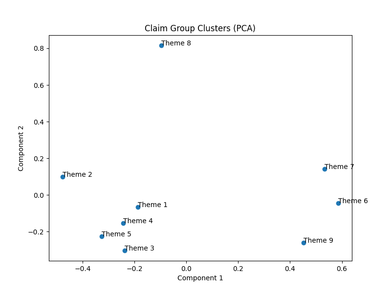

# Research Digest Agent

An autonomous agent that ingests multiple sources on a topic, extracts key claims, removes redundancy, preserves conflicting viewpoints, and produces a structured, evidence-backed research brief.

---

## Table of Contents

1. [How It Works](#how-it-works)
2. [Project Structure](#project-structure)
3. [Installation](#installation)
4. [Environment Setup](#environment-setup)
5. [How to Run](#how-to-run)
6. [Output Files](#output-files)
7. [Running Tests](#running-tests)
8. [Questions](#questions)
9. [Stretch Goals Implemented](#stretch-goals-implemented)
10. [Limitation](#limitation)
11. [Improvement With More Time](#improvement-with-more-time)

---

## How It Works

The agent runs a sequential pipeline:

```
Input (URLs or Local Folder)
        ↓
1. Content Ingestion       — fetch/read, clean HTML, store metadata
        ↓
2. Claim Extraction        — LLM extracts claims + evidence + confidence
        ↓
3. Claim Validation        — evidence must exist verbatim in source text
        ↓
4. Embedding               — sentence-transformer encodes each claim
        ↓
5. Semantic Grouping       — cosine similarity clusters similar claims
        ↓
6. Conflict Detection      — LLM checks if similar claims contradict each other
        ↓
7. Export                  — digest.md, sources.json, clusters.png
```

---

## Project Structure

```
Research_Digest_Agent/
│
├── main.py                        # Entry point
│
├── agent/
│   ├── ingestion.py               # Fetch URLs or read local files
│   ├── cleaning.py                # Strip HTML, normalize text
│   ├── claim_extraction.py        # LLM-based claim + evidence + confidence extraction
│   ├── validation.py              # Verify evidence exists in source text
│   ├── embeddings.py              # Sentence-transformer embeddings + cosine similarity
│   ├── grouping.py                # Group similar claims, separate conflicts
│   ├── conflict.py                # LLM conflict detection between claim pairs
│   ├── digest.py                  # Generate digest.md
│   ├── exporter.py                # Generate sources.json
│   ├── vizualization.py           # PCA cluster plot
│   └── models.py                  # Pydantic data models (Source, Claim, ClaimGroup)
│
├── config/
│   └── settings.py                # Load env variables and thresholds
│
├── tests/
│   └── test_agent.py              # 3 pytest tests
│
├── test_inputs/                   # Sample inputs for each test scenario
│   ├── empty_source/
│   ├── duplicate_source/
│   ├── conflict_source/
│   ├── mixed_input_source/
│   └── urls_5_source/
│
├── test_results/                  # Pre-generated outputs for each scenario
│   ├── empty/
│   ├── duplicate/
│   ├── conflict/
│   ├── mixed_input/
│   └── urls_5/
│
├── data/outputs/                  # Live output from the latest run
│   ├── digest.md
│   ├── sources.json
│   └── clusters.png
│
├── conftest.py                    # Pytest path configuration
├── .env                           # API keys and config (not committed)
├── requirements.txt
└── README.md
```

---

## Installation

```bash
git clone <repo-url>
cd Research_Digest_Agent
python -m venv venv
venv\Scripts\activate        # Windows
pip install -r requirements.txt
```

---

## Environment Setup

Create a `.env` file in the root directory:

```
OPENROUTER_API_KEY=your_api_key_here
OPENROUTER_BASE_URL=https://openrouter.ai/api/v1
CHAT_MODEL=meta-llama/llama-3-8b-instruct
SIMILARITY_THRESHOLD=0.65
MAX_CLAIMS_PER_SOURCE=5
MIN_CONTENT_LENGTH=200
```

| Variable | Description |
|---|---|
| `OPENROUTER_API_KEY` | Your OpenRouter API key |
| `OPENROUTER_BASE_URL` | OpenRouter API base URL |
| `CHAT_MODEL` | LLM used for claim extraction and conflict detection |
| `SIMILARITY_THRESHOLD` | Cosine similarity cutoff for grouping claims (0.0–1.0) |
| `MAX_CLAIMS_PER_SOURCE` | Maximum claims extracted per source |
| `MIN_CONTENT_LENGTH` | Minimum characters required to process a source |

---

## How to Run

### Option 1 — URLs

Create a text file with one URL per line:

```
https://example.com/article1
https://example.com/article2
```

```bash
python main.py --urls_file <path_to_urls_file> --topic "<your_topic>"
```

### Option 2 — Local Folder

The folder can contain `.txt` or `.html` files:

```bash
python main.py --folder_path <path_to_folder> --topic "<your_topic>"
```

### Option 3 — Both Together

```bash
python main.py --urls_file <path_to_urls_file> --folder_path <path_to_folder> --topic "<your_topic>"
```

Outputs are written to `data/outputs/` after each run. Re-running overwrites the previous output — no duplication.

---

## Output Files

All outputs are saved to `data/outputs/`:

### `digest.md`
Structured research summary organised into numbered themes. Each claim is listed with its source title. Multiple claims in the same theme means they were grouped as semantically similar across sources.

Sample output:
```markdown
# Research Digest: AI in Healthcare

## Theme 3

- **Claim:** Data-driven machine learning has emerged as a promising approach for building accurate and robust statistical models from medical data.
  - Source: The future of digital health with federated learning | npj Digital Medicine

- **Claim:** Machine learning is a common form of AI in healthcare.
  - Source: Artificial intelligence in healthcare | Wikipedia

## Theme 4

- **Claim:** Existing medical data is not fully exploited by ML primarily because it sits in data silos and privacy concerns restrict access to this data.
  - Source: The future of digital health with federated learning | npj Digital Medicine
```

### `sources.json`
Per-source metadata and all extracted claims with evidence quotes and confidence scores. The evidence field is the exact quote from the source text that supports the claim.

Sample output:
```json
{
  "7c7e3fbb-e723-4374-bab3-a0993a58082c": {
    "title": "The future of digital health with federated learning | npj Digital Medicine",
    "url": "https://www.nature.com/articles/s41746-020-00323-1",
    "length": 57953,
    "claims": [
      {
        "claim": "Data-driven machine learning has emerged as a promising approach for building accurate and robust statistical models from medical data.",
        "evidence": "Data-driven machine learning (ML) has emerged as a promising approach for building accurate and robust statistical models from medical data, which is collected in huge volumes by modern healthcare systems.",
        "confidence": 0.95
      },
      {
        "claim": "Existing medical data is not fully exploited by ML primarily because it sits in data silos and privacy concerns restrict access to this data.",
        "evidence": "Existing medical data is not fully exploited by ML primarily because it sits in data silos and privacy concerns restrict access to this data.",
        "confidence": 0.97
      }
    ]
  }
}
```

### `clusters.png`
2D PCA scatter plot of all theme groups. Each point is one theme — closer points are semantically related, further points cover distinct topics.

Sample output:



---

## Running Tests

```bash
pytest tests/test_agent.py -v
```

Three tests are included:

| Test | What it verifies |
|---|---|
| `test_empty_source_skipped` | Empty files produce no sources — pipeline skips them safely |
| `test_duplicate_claims_are_grouped` | Identical claims from different sources are merged into one group |
| `test_conflicting_claims_kept_separate` | Contradicting claims are never merged, even when semantically similar |

Tests 2 and 3 mock the LLM and embedding calls for speed and determinism. Test 1 uses the real `test_inputs/empty_source/empty.txt` file.

### Sample Inputs and Pre-generated Outputs

Each test scenario has a corresponding input folder and a pre-generated output folder:

| Scenario | Input | Output |
|---|---|---|
| 5 URLs | `test_inputs/urls_5_source/` | `test_results/urls_5/` |
| Duplicate content | `test_inputs/duplicate_source/` | `test_results/duplicate/` |
| Conflicting claims | `test_inputs/conflict_source/` | `test_results/conflict/` |
| Mixed (txt + html) | `test_inputs/mixed_input_source/` | `test_results/mixed_input/` |
| Empty file | `test_inputs/empty_source/` | `test_results/empty/` |

Each output folder contains `digest.md`, `sources.json`, and `clusters.png` from running the agent on that input. To regenerate any output, run the agent with the corresponding input and copy the results from `data/outputs/` to the relevant `test_results/` subfolder.

---

## Questions

### How does the agent process sources step by step?

1. **Ingestion** — URLs are fetched with `requests`; local files are read directly. Duplicate URLs are skipped. HTML is parsed with BeautifulSoup, scripts and styles are stripped, and text is normalised. Files shorter than `MIN_CONTENT_LENGTH` are discarded with a warning.

2. **Claim Extraction** — Each source's cleaned text is sent to an LLM via OpenRouter. The LLM returns up to `MAX_CLAIMS_PER_SOURCE` structured claims, each containing a concise statement, an exact evidence quote from the text, and a confidence score (0.0–1.0).

3. **Validation** — Each claim's evidence string is checked as a literal substring of the original source content. Claims whose evidence cannot be found verbatim are dropped. This prevents hallucinated or paraphrased claims from entering the digest.

4. **Embedding** — All validated claims are encoded into 384-dimensional vectors using `sentence-transformers/all-MiniLM-L6-v2`.

5. **Grouping** — Cosine similarity is computed between every pair of claim vectors. If similarity exceeds `SIMILARITY_THRESHOLD`, the pair is a candidate for the same theme group.

6. **Conflict Detection** — Before merging a similar pair, both claims are sent to the LLM with a YES/NO prompt asking if they contradict each other. If YES, they are placed in separate theme groups, each retaining its original source attribution.

7. **Export** — `digest.md` is written with numbered themes and source titles. `sources.json` is written with full metadata and claims per source. A PCA cluster plot is saved as `clusters.png`.

---

### How are claims grounded?

Every claim returned by the LLM must include an `evidence` field containing an exact quote from the source text. After extraction, `validation.py` checks that this quote is a literal substring of the original content (`claim.evidence in original_text`). If the match fails, the claim is discarded entirely. This ensures every claim in the final digest can be traced back to a specific passage in a real source.

---

### How does deduplication and grouping work?

Claims are embedded into 384-dimensional vectors. Cosine similarity is computed across all claim pairs. If two claims score above `SIMILARITY_THRESHOLD` (default `0.65`, configurable in `.env`), they are candidates for the same theme group.

Before merging, an LLM conflict check runs on the pair. If the claims contradict each other, they are kept as separate themes — each attributed to its own source. This means similar claims are deduplicated into shared themes, while conflicting viewpoints are preserved side by side.

---

### One limitation

The evidence grounding check is a strict substring match. If the LLM slightly rephrases or reformats a quote — different whitespace, punctuation, or truncation — the claim is rejected even if the content is valid. This causes over-filtering on sources with complex or inconsistent formatting, and can result in a source contributing fewer claims than expected.

---

### One improvement with more time

Replace the strict substring validation with a fuzzy or semantic match (e.g., checking that the evidence has a cosine similarity above a threshold with passages from the source). This would retain valid claims that fail the exact match due to minor formatting differences, improving recall without sacrificing grounding.

---

## Stretch Goals Implemented

| Goal | Status |
|---|---|
| Confidence score per claim | Implemented — LLM returns a 0.0–1.0 score per claim, stored in `sources.json` |
| Simple clustering visualization | Implemented — PCA scatter plot saved as `clusters.png` |
| Configurable grouping threshold | Implemented — `SIMILARITY_THRESHOLD` in `.env` |
| Re-run without duplicating outputs | Implemented — output files are overwritten on each run; duplicate URLs are skipped within a run |
